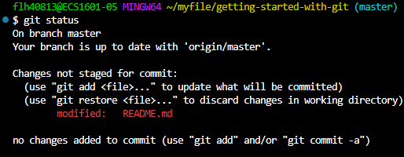

# CSUN ECE 16942 
## Getting started with Git
**Name: Francisco Hernandez**  
**Date: 8.26.2024**
<ol>
<li>FPGA</li>
<li>VHDL</li>
<li>Verilog</li>
</ol>
  

[Francisco Hernandez](https://github.com/FranciscoCSUN)  
```VHDL
library ieee;
use ieee.std_logic_1164.all;
use ieee.std_logic_unsigned.all;

entity counter is
    port (
        clk : in std_logic;
        reset : in std_logic;
        enable : in std_logic;
        count : out std_logic_vector(3 downto 0)
    );
end counter;

architecture Behavioral of counter is
    signal pre_count : std_logic_vector(3 downto 0);
begin
    process (clk, enable, reset)
    begin
        if reset = '1' then
            pre_count <= "0000";
        elsif (clk = '1' and clk'event) then
            if enable = '1' then
                pre_count <= pre_count + "1";
            end if;
        end if;
    end process;
    count <= pre_count;
end Behavioral;
```


![git status before stage]  
